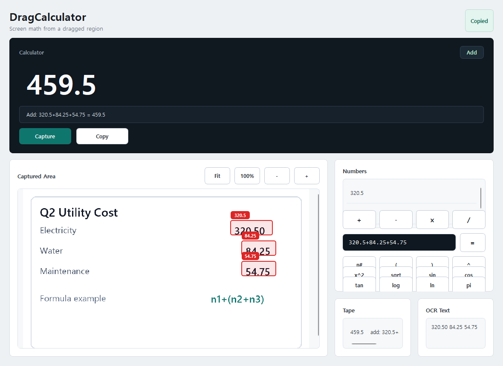
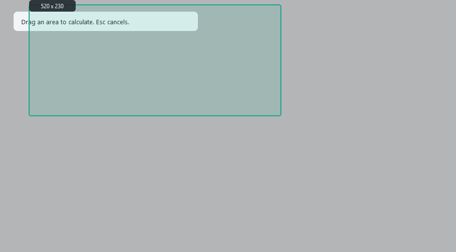

# DragCalculator

[English README](README.md)

DragCalculator는 화면에서 드래그한 영역의 숫자를 OCR로 읽고 바로 계산할 수 있는 Windows 데스크톱 계산기입니다. 캡처한 이미지를 보면서 숫자 인식 결과를 수정하고, 순서를 바꾸고, 일반 계산부터 간단한 공학용 수식까지 처리할 수 있습니다.



## 주요 기능

- 화면 특정 영역을 드래그해서 해당 영역만 CPU OCR로 인식
- 캡처 이미지 미리보기와 숫자별 빨간 박스 표시
- 빨간 박스 클릭 또는 숫자 목록 직접 편집으로 OCR 결과 수정
- 숫자 목록 드래그앤드롭 순서 변경
- 전체 숫자에 대해 덧셈, 뺄셈, 곱셈, 나눗셈 일괄 계산
- `n1+(n2+n3)` 같은 숫자 참조 기반 커스텀 수식 지원
- `sqrt`, `sin`, `cos`, `tan`, `log`, `ln`, 제곱, `pi` 등 공학용 계산 보조 기능
- 최신 결과 자동 클립보드 복사
- PyInstaller 기반 Windows 실행파일 빌드

## 스크린샷

### 수식 워크벤치


### 캡처 오버레이



## 사용 예시

인식된 숫자:

```text
3, 4, 5
```

일괄 연산:

```text
3+4+5 = 12
3*4*5 = 60
```

커스텀 수식:

```text
n1+(n2+n3) -> 3+(4+5) = 12
```

공학용 수식:

```text
sqrt(n1^2+n2^2)
```

## 로컬 실행

```powershell
python -m venv .venv
.\.venv\Scripts\python.exe -m pip install -r requirements.txt
.\.venv\Scripts\python.exe run.py
```

가상환경이 이미 활성화되어 있다면:

```powershell
python run.py
```

## Windows EXE 빌드

```powershell
powershell -ExecutionPolicy Bypass -File .\build.ps1
```

실행파일은 아래 경로에 생성됩니다.

```text
dist\DragCalculator\DragCalculator.exe
```

## 스크린샷 생성

```powershell
$env:PYTHONPATH="src"
.\.venv\Scripts\python.exe .\tools\generate_screenshots.py
```

스크린샷은 아래 폴더에 저장됩니다.

```text
docs\screenshots
```

## 참고

- GPU는 필요하지 않습니다.
- OCR 정확도는 캡처 크기, 대비, 글꼴 선명도, 화면 배율의 영향을 받습니다.
- 캡처 오버레이에서 `Esc`를 누르면 취소됩니다.
- 빌드 결과물인 `dist` 폴더는 git에 포함하지 않도록 설정되어 있습니다.

